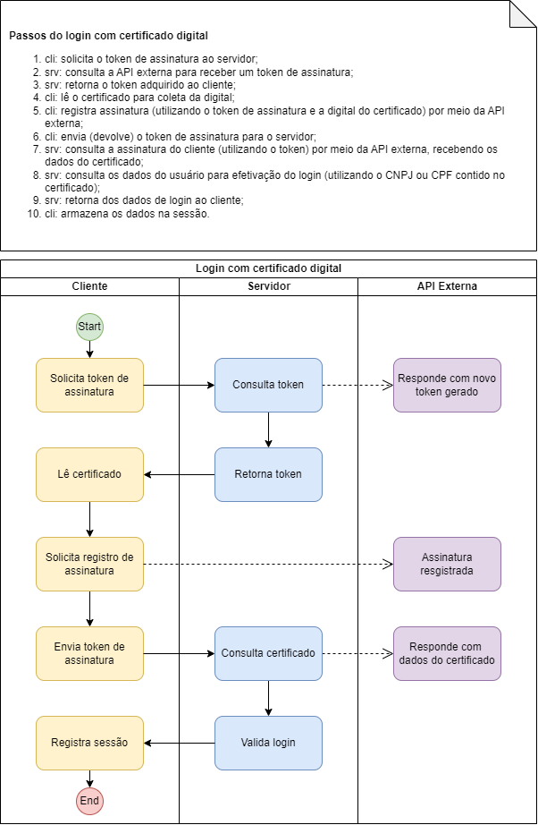

# AUTENTICAÇÃO COM CERTIFICADO DIGITAL

> A autenticação com certificado digital será feita utilizando a API disponibilizada pela Lacuna Software acessado via `https://pki.rest/<URN_DO_RECURSO>`

## REGRAS DE NEGÓCIO ATENDIDAS NESTE CASO DE USO:

1. Caso ocorra algum erro no processamento das informações, a mensagem `60` deverá ser retornada;
1. Caso a pessoa não exista como usuário externo (`TBL_SEG_USUARIO_EXTERNO`), a mensagem `16` deverá ser retornada;
1. Caso o usuario esteja inativo (`COD_ATIVO = 0`), a mensagem `45` deverá ser retornada;
1. Caso o usuario esteja com a senha bloqueada (`COD_SENHA_BLOQUEADA = 1`), a mensagem `42` deverá ser retornada.
1. O objeto de retorno deverá atender ao seguinte esquema (Interface TypeScript JSON):
```json
{
    codUsuarioExterno: number;
    codInteressado: number;
    txtInteressado: string;
    txtCnpjCpf: string;
    txtNomeSocial?: string;
    txtRazaoSocial?: string;
}
```
> 1. Caso o valor da propriedade `txtCnpjCpf` seja um CNPJ, a propriedade opcional `txtRazaoSocial` deverá ser obrigatoriamente retornada;
> 1. Caso o valor da propriedade `txtCnpjCpf` seja um CPF, a propriedade opcional `txtNomeSocial`, caso possua valor, deverá ser obrigatoriamente retornada;

## Fluxograma

